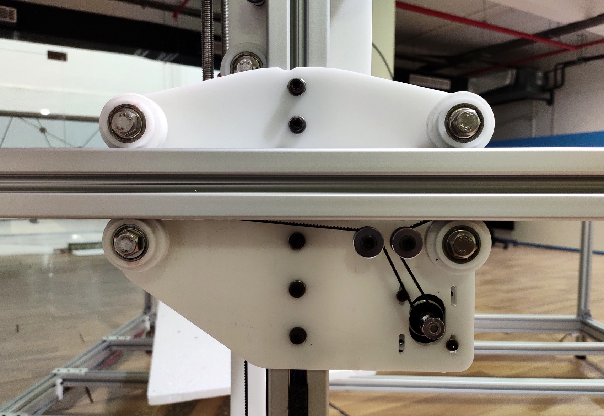
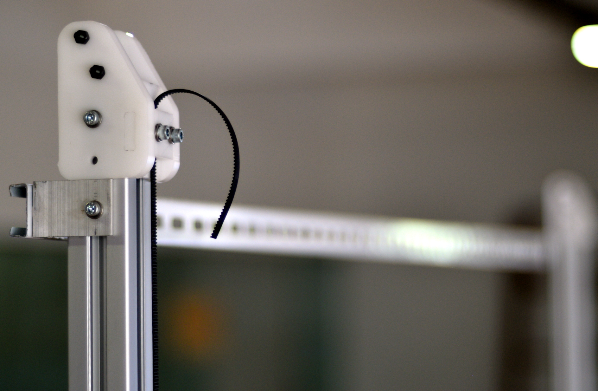

# User Manual

## Requirements

1. Windows Desktop PC.
2. Mach3 installation file, USB B cable.
3. Utilities and Power.

## Software

#### Mach3

1. Install Mach3 on system (follow Mach3 install guide in Mach folder).
2. Restart the system (mandatory).
3. Copy and paste Hotwire.XML file provided into C:/Mach3/.
4. Connect USB cable to PC, open Mach3, select Hotwire profile.
5. Press reset and Use arrow keys to move the machine, see if the numbers on DRO are changing.

#### Inkscape

1. Go to https://inkscape.org/
2. Download and install inskcape.
3. Go to File>preferences>behaviour decrease the torelance for simplify command.

#### FCNC

1. Go to http://docado.com/FCNC.html
2. Download and install the FCNC software.
3. Open software, load an SVG file, go to settings and set feedrates.

## Workflow 

1. Draw the design in Inkscape.
2. Select the drawing and go to Path settings.
3. Click object to path.
4. Save file as .SVG

5. Open FCNC > load the .svg file.
6. Click show points > right click a point and set start path.
7. Alternateviely, go to Edit> Auto path 
8. Export the design as G-code.

9. Start Mach3, choose the Hotwire profile.
10. Turn on the machine and connect the USB cable.
11. Hit the reset button in the Mach3 panel.
12. Home the machine using the ref all button or if any manual movement, adjust accordinly.
13. Jog the axes using the arrow keys to the start point of the cut.
14. Click zero for all the axes to set the origin point.
15. Click Load G-code button and select the g-code to upload.
16. A preview of g-code will be displayed in the right.
17. Make sure the cutting wire is taught and there is enough material for the design.
18. Click Cycle-Start to start cutting.

## Maintanance

1. Make sure the bearings are tight against the frame.
2. Make sure the belts for all the axes are tight.
3. For tightening the belts of the x-axis,

	1. loosen the 4 screws in the stepper motor.  
	2. push the motor downwards, and tighten the screws.  
4. For tightening the belts of the y-axis,  

	1. loosen the 2 screws at the top of the tower.
	2. pull the bet upwards through the clamping piece.
	3. Move the y-axis back and forth manually.
	4. keep tension on the belt and tighten the 2 screws.
	5. Repeat for the other side.